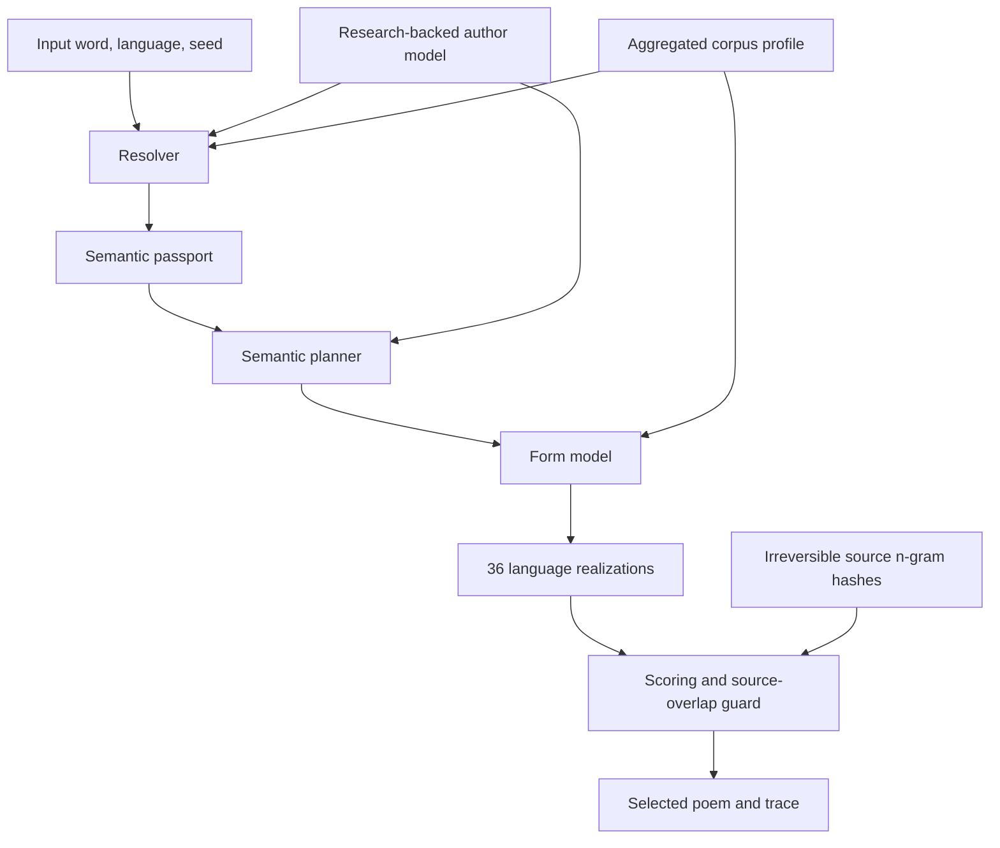

# Spurwerk

### An explainable computational model of Paul Celan's late poetics

Spurwerk is a research-driven text generator by **Dmitrii Shchukin**. It accepts a word and models what that object might undergo inside a formally reconstructed Celanian world: how its material properties meet pressure, contradiction, address, silence, and residue.

This is not a chatbot trained to imitate Paul Celan, and it is not an attempt to reconstruct a historical person's mind. It is an executable interpretation: a transparent computational model built from Celan's texts, scholarship, corpus measurements, and Shchukin's close reading of seven poems from *Lichtzwang*.

> Celan's texts provide language and formal constraints. Scholarship provides traceable relations. Close reading provides the interpretive model. The input word introduces new matter. Spurwerk models what happens to that matter under the pressure of this poetic world.

Version: **0.2.0**

Runtime: **Node.js 20+**

External APIs and runtime dependencies: **none**

## Why this project exists

Most language generators move directly from text statistics to a plausible continuation. Spurwerk asks a narrower question:

> Can a close reading become an inspectable computational process without reducing a poem to style tokens?

The project treats interpretation as something that can be executed, tested, challenged, and revised. A generated poem is therefore not presented as "Celan speaking again." It is an experiment showing the formal consequences of one documented reading of Celan.

## How it works



The runtime pipeline is:

1. **Resolve the input.** The system looks for an exact concept, meaningful parts of a compound, or a permitted material-semantic bridge.
2. **Build a semantic passport.** It records morphology, physical properties, internal oppositions, cultural associations, confidence, and six form pressures.
3. **Plan an event.** Instead of selecting the next likely word, the planner creates a trajectory: object, property, transformation, counterforce, address to `Du`, and unresolved residue.
4. **Decide the form.** `gravity`, `compression`, `fragmentation`, `pause`, `motion`, and `address` influence line count, line width, breaks, and empty intervals.
5. **Realize candidates.** A German or Russian micro-grammar produces 36 deterministic variants from the plan.
6. **Evaluate and select.** Candidates are scored for continuity, preservation of the input, realization of the planned stages, repetition, premature consolation, and overlap with hashed four-word source fragments.
7. **Explain the result.** Trace mode exposes the semantic passport, claims, source identifiers, formal decisions, corpus observations, and final score.

## What changed in 0.2

Version 0.1 wandered through a hand-built motif graph and inserted selected motifs into templates. Version 0.2 first builds an internal semantic plan:

```text
object
-> material property
-> Celanian transformation
-> counterforce or contradiction
-> address to Du
-> unresolved residue
```

Only after that does a separate layer decide how the plan should become language and form. The order of lines is therefore intended to carry a non-interchangeable thought rather than a rearrangeable cloud of motifs.

The current research model contains:

- 10 principles of poetic decision-making;
- 27 concept profiles;
- 60 typed interpretive claims with source identifiers;
- six independent form parameters;
- an aggregated profile of 112 poetic units and 2,083 lines;
- a deterministic 36-candidate generation and selection process;
- semantic and technical regression tests.

## Quick start

```bash
git clone git@github.com:dschkn/spurwerk_celan_model.git
cd spurwerk_celan_model

node bin/spurwerk.js Stein
node bin/spurwerk.js Stein --trace
node bin/spurwerk.js Stein --profile
node bin/spurwerk.js Luftballon --seed zweite-fassung
node bin/spurwerk.js "воздушный шарик" --lang ru
node bin/spurwerk.js Antenne --json
```

Research and validation commands:

```bash
node bin/spurwerk.js --stats
node bin/spurwerk.js --sources
npm test
```

The same word with the same `--seed` always produces the same result. Use `--candidates N` to change the number of candidates considered.

## Semantic passports

Spurwerk distinguishes knowledge from conjecture. Input resolution has four levels:

1. exact known term;
2. recognized component of a compound or phrase;
3. explicit material-semantic bridge;
4. `opaque foreign body`.

For `Luftballon`, the model preserves air, enclosed volume, shell, pressure, lift, tethering, and rupture before connecting them to breath, distance, and address.

For a completely unknown object such as `кварцебот_77`, the model keeps only what it can honestly observe: spelling, length, segmentation, digits, and foreignness. It does not silently turn every unknown object into ash, stone, memory, or wound.

## Semantic pressure and corpus evidence

Spurwerk keeps two kinds of evidence separate.

- **Semantic pressure** comes from research and close reading: material weight, compression, rupture, pause, motion, and capacity for address.
- **Corpus association** comes from observed form: line length, word position, isolation, chronology, and distribution across poems.

This distinction matters. In the current corpus sample, forms containing `stein` occur 23 times in 14 poems. Their lines average 5.913 words, compared with 4.105 words overall. The corpus therefore does **not** support the simple claim that stone automatically produces a short line.

When `Stein` generates a compressed five-line trajectory, that formal pressure comes primarily from documented interpretations of weight, mineral duration, mute witness, `Sterbelicht`, and the conflict between gravity and flight. The trace reports this separately from the corpus observation.

See [Corpus Method](docs/CORPUS_METHOD.md) for the measurement procedure.

## Explainability and provenance

Run `--trace` to inspect:

- the resolved concept and confidence level;
- material properties and oppositions;
- the six form pressures;
- the central semantic tension;
- every stage of the planned event;
- claim IDs, source IDs, and epistemic status;
- the formal decision;
- corpus evidence as a separate layer;
- candidate score and overlap check.

`data/author-model.json` is the central research object. Interpretive relations are stored as typed claims rather than hidden in a prompt or model weights. Their statuses distinguish textual observation, scholarship, Shchukin's reading, and working hypothesis.

## Corpus policy

The repository contains **no full poems, books, articles, PDFs, scans, translations, or research archives**.

It includes only:

- aggregated formal measurements;
- limited contextual word profiles;
- paraphrased, source-identified interpretive claims;
- irreversible hashes of four-word source sequences used as an anti-copying guard.

The local profile can be rebuilt from a legally available research copy:

```bash
node scripts/build-profile.mjs /path/to/bilingual-corpus.pdf
```

Rebuilding requires Poppler's `pdftotext`. Normal generation does not.

Current corpus measurements:

| Metric | Value |
| --- | ---: |
| Poetic units | 112 |
| Lines | 2,083 |
| Word tokens | 8,551 |
| Unique tokens | 2,743 |
| Whole corpus median words per line | 4 |
| Whole corpus median lines per poem | 13 |
| Late corpus median words per line | 3 |
| Late corpus median lines per poem | 9 |

## Repository structure

```text
bin/spurwerk.js             CLI, trace, profiles, statistics, sources
src/resolver.mjs            semantic resolution and passports
src/planner.mjs             semantic event planning
src/form-model.mjs          multidimensional form decisions
src/realizer.mjs            German and Russian micro-grammars
src/generator.mjs           candidate generation and scoring
src/plagiarism-guard.mjs    four-word source-overlap control
data/author-model.json      concepts, claims, sources, principles
data/style-profile.json     aggregated corpus and concept contexts
data/source-ngrams.json     irreversible four-word sequence hashes
scripts/build-profile.mjs   reproducible local profile builder
test/spurwerk.test.mjs      semantic and technical regression tests
docs/                       model, corpus, and research documentation
```

More detail is available in [Model Architecture](docs/MODEL.md) and the [Research Ledger](docs/RESEARCH_LEDGER.md).

## Sources actually used

The list below is intentionally limited to material that entered version 0.2 directly or shaped Dmitrii Shchukin's seven-poem study, which serves as the model's gold interpretive corpus. General web pages and publications merely catalogued for possible future work are excluded. Source files themselves are not distributed in this repository.

### Direct model sources

- Dmitrii Shchukin, *Paul Celan: Sieben Gedichte aus Lichtzwang* (translation and commentary, 2026). Read in full and used as the gold interpretive corpus.
- Paul Celan, *Die Gedichte. Neue kommentierte Gesamtausgabe in einem Band*, edited and commented by Barbara Wiedemann, Suhrkamp, 2018. Used for the German text, chronology, commentary, and lexical checks.
- Paul Celan, *Gedichte. Prosa. Briefe / Стихотворения. Проза. Письма*, edited by Mark Belorusec, Ad Marginem, 2013. Used as the principal bilingual corpus for aggregated formal measurements.
- Paul Celan, *Der Meridian. Endfassung - Vorstufen - Materialien*, Suhrkamp, 1999. Used for attention, encounter, breath-turn, individuation, the `Du`, and the open question.
- Paul Celan, Bremen Prize speech (1958). Used for orientation, language after catastrophe, reality, temporality, and address.
- *Celan, Hearing Residues (Lichtzwang)*, unpublished research note from the supplied archive. Used for `Hörreste/Sehreste`, sensory remainder, survival, dialogue, compounds, and the movement toward `Du`.
- Ralf Willms, *Das Motiv der Wunde im lyrischen Werk von Paul Celan: Historisch-systematische Untersuchungen zur Poetik des Opfers* (doctoral dissertation, FernUniversität in Hagen, 2011). Model-relevant chapters and conclusion used for wound, victimhood, truth, return, and the refusal of uncomplicated redemption.
- Meret Eliezer, *Aktualisierte Sprache: Schweigen im Zeichen des Eingedenkens bei Paul Celan*, Böhlau/Brill, 2025, DOI 10.7788/9783412531201. Model-relevant chapters and conclusion used for ethical silence, remembrance, negativity, and renewed speech.
- Uta Degner and Irene Fußl, eds., *Paul Celan. Dichtung im Übergang*, *Sprachkunst* 53 (2022), Austrian Academy of Sciences, published 2023. Relevant articles used for immanent composition, transition, typography, non-human witness, and the present tense of the wound.
- Ute Bruckinger, *A la surface des fonds: Die Graphikerin und Malerin Gisèle Celan-Lestrange (1927-1991)* (doctoral dissertation, Universität Tübingen, 2018). Sections on *Schwarzmaut* and *Lichtzwang* used for image-poem dialogue, scratches, fractures, and paired oppositions.
- Paul Celan, *Sprich auch du / Говори и ты*, selected, translated, and commented by Anna Glazova, Ailuros Publishing, 2012. Used for bilingual lexical and interpretive checking.

### Sources used in the seven-poem study

- Bertrand Badiou, *Paul Celan. Lichtzwang. Vorstufen - Textgenese - Endfassung*, Suhrkamp, 2005.
- Israel Chalfen, *Paul Celan (1920-1970). Ein jüdischer Dichter deutscher Sprache aus der Bukowina. Die Biographie*, Böhlau, 2020.
- Paul Celan and Gisèle Celan-Lestrange, *Briefwechsel*, edited by Bertrand Badiou with Eric Celan, Suhrkamp, 2001.
- Paul Celan and Gustav Chomed, *Briefwechsel*, edited by Barbara Wiedemann, Suhrkamp, 2005.
- Clarise Samuels, *Holocaust Visions: Surrealism and Existentialism in the Poetry of Paul Celan*, Camden House, 2005.
- Lydia Kölle, "Grenzgänge 'im Schatten des Wundenmals': Paul Celan in Colmar, 25. März 1970," in Degner and Fußl, eds., *Paul Celan. Dichtung im Übergang*, pp. 101-132.
- Barbara Wiedemann, "Paul Celan: Lichtzwang," afterword to the historical-critical edition, and the related Planet Lyrik publication (2020).
- Barbara Wiedemann, *Die Goll-Affäre: Dokumente zu einer 'Infamie'*, Suhrkamp, 2000.
- Pierre Joris, trans., *Breathturn into Timestead: The Collected Later Poetry of Paul Celan*, Farrar, Straus and Giroux, 2014.
- Michael Hamburger, trans., *Paul Celan: Collected Verse*, Liveright, 1988, including his introduction to *The Poems of Paul Celan*.
- John Felstiner, *Paul Celan: Poet, Survivor, Jew*, Yale University Press, 1995.
- John Felstiner, trans., *Selected Poems and Prose of Paul Celan*, W. W. Norton, 2001.
- Winfried Menninghaus, *Paul Celan: Magie der Form*, Suhrkamp, 1980.
- Nitzan Lebovic, *Near the End: Celan between Scholem and Heidegger*, Stanford University Press, 2019.
- Christoph Brukhinger, *Studien zu Celan und Gisèle Celan-Lestrange*.
- "The Allegorical Image and Presence in Paul Celan's Wortaufschüttung" (2020).
- Arielle Angel, "Celan at 100," *Jewish Currents* (2020).
- Jacques Derrida, *Schibboleth: Pour Paul Celan*, Éditions Galilée, 1986; German translation by Wolfgang Sebastian Baur, Passagen, 1986.
- Jacques Derrida, *Psyché: Inventions de l'autre*, Galilée, 1987.
- Jacques Derrida, *De la grammatologie*, Les Éditions de Minuit, 1967.
- Jana Maria Weiß, *Eine grauere Sprache: Paul Celans Poetik der Mehrsprachigkeit*, De Gruyter, 2025, especially pp. 34-42.
- Jacob and Wilhelm Grimm, *Deutsches Wörterbuch*, entries "Sterbelicht" and "Hucke".
- Duden editorial staff, *Duden: Deutsches Universalwörterbuch*, Dudenverlag, 2019, entry "mittragen".
- Gerhard Kittel, ed., *Theologisches Wörterbuch zum Neuen Testament*, vol. 3, Kohlhammer, 1938, entry on revelation/apocalypse.
- Daniel Casper von Lohenstein, *Arminius* (1689), consulted through the *Deutsches Wörterbuch* for the historical use of "Sterbelicht."
- Horst Hanisch, *Aufs Korn genommen: Redewendungen aus der Welt des Militärs*, Theiss, 2008.
- Jiří Zahradník, Irmgard Jung, Dieter Jung et al., *Käfer Mittel- und Nordwesteuropas*, Parey, 1985, p. 286, together with the reference entry on the Himmelblauer Blattkäfer.
- Deutsche Flugsicherung, *Luftfahrtlexikon*, and *AIP Deutschland*, GEN 3.4, Sprechfunkverfahren.
- Dieter Scholz, *Flugzeugsysteme: Fahrwerk*, Hochschule für Angewandte Wissenschaften Hamburg.
- Johann Gottfried Walther, *Musicalisches Lexicon oder Musicalische Bibliothec*, Leipzig, 1732, pp. 186 and 486.
- Ernst Klee, Willi Dressen, and Volker Riess, eds., *Deutsche Luftfahrttechnik im Zweiten Weltkrieg*, entry "X-Verfahren."
- Wolfgang Kühr, *Der Privatflugzeugführer*, vol. 3: *Technik II*, 1983.

## Limits

Spurwerk 0.2 remains a research prototype.

- The concept graph is selective rather than a complete dictionary of Celan.
- Unknown meanings are not yet resolved through a dictionary or local embedding model.
- German and Russian realization use constrained micro-grammars.
- The corpus sample is incomplete and contains OCR noise.
- Candidate scoring can test structural coherence, but it cannot measure poetic necessity or literary value.
- Interpretive claims model a documented reading, not neurological or biographical facts about Celan.

The next useful step is not a universal LLM. It is a larger page-level provenance layer, stricter semantic tests, expert evaluation of generated trajectories, and a local dictionary/embedding bridge that can propose meanings without silently authoring them.

## Authorship and rights

Concept, research, translations, interpretive model, and software direction: **Dmitrii Shchukin, 2026**.

See [NOTICE.md](NOTICE.md). No license to redistribute third-party texts, translations, annotations, images, or scans is granted by this repository.
